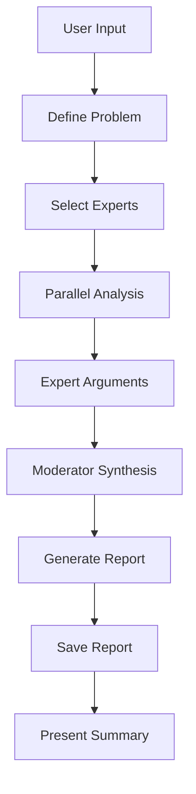

# Command: /expert-consilium

> **Expert Consilium** — Запуск систематического анализа сложных технических решений группой из 13 экспертов

## Description

Запускает структурированные дебаты между виртуальными экспертами для анализа проблемы, предложения решения или архитектурного решения. Каждый эксперт представляет свою перспективу, а модератор синтезирует консолидированную рекомендацию.

## Usage

```
/expert-consilium [OPTIONS] <problem-statement>
```

## Options

| Option | Description | Default |
|--------|-------------|---------|
| `--experts` | Список экспертов (через запятую) или `all` | `all` |
| `--format` | Формат вывода: `report`, `summary`, `debate` | `report` |
| `--output` | Путь для сохранения отчёта | `docs/analysis/{timestamp}-consilium.md` |
| `--timeout` | Таймаут на эксперта (секунды) | `120` |
| `--consensus` | Минимальный уровень консенсуса: `unanimous\|strong\|majority\|any` | `majority` |

## Expert Panel

### Архитектура (1-3)
- `solution-architect` — Solution Architect (weight: 1.5x)
- `docker-engineer` — Senior Docker Engineer
- `unix-script-expert` — Unix Script Expert (Bash/Zsh Master)

### DevOps & Automation (4-6)
- `devops-engineer` — DevOps Engineer
- `cicd-architect` — CI/CD Architect
- `gitops-specialist` — GitOps 2.0 Specialist

### Infrastructure & Reliability (7-9)
- `iac-expert` — Infrastructure as Code Expert
- `backup-specialist` — Backup & Disaster Recovery Specialist
- `sre` — Site Reliability Engineer

### AI & Development (10-13)
- `ai-ide-expert` — AI IDE Expert (Claude Code)
- `prompt-engineer` — Senior Prompt Engineer
- `tdd-expert` — Test-Driven Development Expert
- `uat-engineer` — User Acceptance Testing Engineer

## Examples

### Пример 1: Полный анализ
```
/expert-consilium "Should I migrate from bash to Python for automation scripts?"
```

**Output:**
```
Expert Consilium Analysis
========================

Problem: Migrate bash scripts to Python?

Expert Positions:
  ✅ Support (7/13): solution-architect, devops-engineer, tdd-expert, ...
  ❌ Oppose (3/13): unix-script-expert, docker-engineer, ...
  ⚖️ Neutral (3/13): iac-expert, ...

Consensus: Majority (7/13)
Recommendation: Hybrid approach — Bash for <50 lines, Python for complexity >100 lines
Confidence: 0.72

Report saved: docs/analysis/2026-02-10-consilium-bash-python.md
```

### Пример 2: Выборочные эксперты
```
/expert-consilium --experts=devops-engineer,sre,iac-expert "Is this Docker Compose setup production-ready?"
```

### Пример 3: Краткая сводка
```
/expert-consilium --format=summary "Should I add TypeScript to this project?"
```

### Пример 4: Архитектурное решение
```
/expert-consilium --consensus=strong "Should I adopt microservices architecture for this application?"
```

## Output Formats

### report (по умолчанию)
Полный отчёт в markdown с:
- Позициями всех экспертов
- Синтезом рекомендаций
- Планом действий
- Оценкой рисков

### summary
Краткая сводка с:
- Уровнем консенсуса
- Рекомендацией
- Ключевыми аргументами "за/против"

### debate
Подробная транскрипция дебатов:
- Аргументы каждого эксперта
- Контраргументы
- Эволюция мнений

## Consensus Levels

| Level | Threshold | Interpretation |
|-------|-----------|----------------|
| `unanimous` | 13/13 agree | Clear best path |
| `strong` | 10-12 agree | Good path, minor concerns |
| `majority` | 7-9 agree | Valid path, notable concerns |
| `any` | Any agreement | Context-dependent |

## Token Cost

| Analysis Type | Token Range |
|---------------|-------------|
| All 13 experts | ~3000-5000 |
| 8 experts (filtered) | ~2000-3500 |
| 3-5 experts (focused) | ~1000-2000 |

## Use Cases

### ✅ Идеально для Expert Consilium
- Архитектурные решения (микросервисы vs монолит)
- Выбор технологического стека
- Миграция инфраструктуры
- Изменения в pipeline CI/CD
- Оптимизация производительности

### ❌ Не подходит для Expert Consilium
- Простые баг-фиксы (используйте обычный agent)
- Очевидные изменения (например, опечатки)
- 2-3 файловых обновления (напрямую через Edit)
- Срочные hotfix (делайте сами)

## Integration

**Related Skills:**
- [expert-consilium.md](../skills/expert-consilium.md) — Full skill documentation
- [agent-teams-parallel.md](../skills/agent-teams-parallel.md) — Parallel expert execution

**Related Commands:**
- `/cf-health` — Check system health before major changes
- `/cf-agents` — Generate agents for projects

**Templates:**
- [templates/expert-consilium-template.md](../../templates/expert-consilium-template.md) — Report template

## Workflow



## Best Practices

1. **Чётко формулируйте проблему**
   - Плохо: "Что делать с этим кодом?"
   - Хорошо: "Должен ли я реорганизовать эту 500-строчную функцию на модули, учитывая, что её часто меняют 3 разработчика?"

2. **Предоставляйте контекст**
   - Прикрепляйте соответствующие файлы
   - Описывайте ограничения (timeline, бюджет, команда)
   - Указывайте приоритеты (скорость vs безопасность)

3. **Выбирайте релевантных экспертов**
   - Для Docker вопросов → docker-engineer, devops, sre
   - Для архитектурных решений → solution-architect, iac-expert
   - Для AI/оптимизации → prompt-engineer, ai-ide-expert

4. **Анализируйте консенсус**
   - Unanimous → Действуйте уверенно
   - Strong majority → Действуйте с мониторингом
   - Majority → Действуйте с safeguards
   - Split/No consensus → Соберите больше информации

## Troubleshooting

### Issue: Timeout на экспертов
**Solution:** Увеличьте `--timeout` или уменьшите количество экспертов через `--experts`

### Issue: Нет консенсуса
**Solution:** Это нормально для сложных решений. Используйте отчёт для понимания trade-offs.

### Issue: Слишком много токенов
**Solution:** Используйте `--experts` для выбора 3-5 наиболее релевантных экспертов

---

**Version:** 1.0.0
**Status:** Ready for use
**See also:** [Expert Consilium Skill](../skills/expert-consilium.md)
