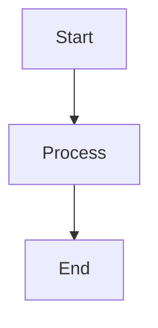
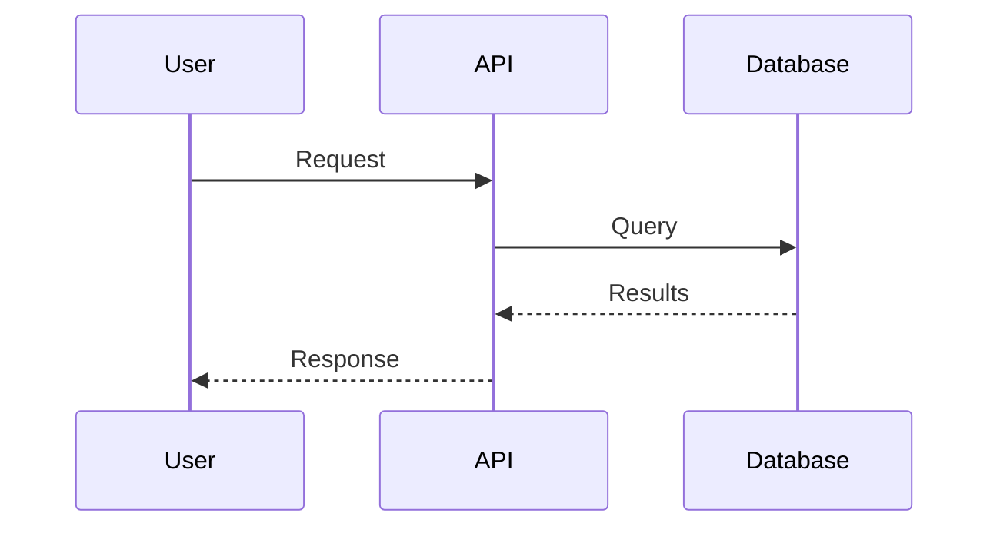

# 📽️ Presentation Archetype

> [🏠 Главная](../../../README.md) → [🎨 Archetypes](../README.md) → [📽️ Presentation](#)

---

## Description

Шаблон для создания презентаций и технической документации с использованием Markdown и Reveal.js.

---

## 🎯 Характеристики

### Tech Stack

| Компонент | Технология |
|-----------|------------|
| **Авторинг** | Markdown |
| **Фреймворк** | Reveal.js |
| **Диаграммы** | Mermaid, PlantUML |
| **Экспорт** | PDF, HTML, reveal.js |
| **Публикация** | GitHub Pages, Vercel, Netlify |

### Features Out-of-the-Box

✅ **Markdown Authoring** — пишешь в Markdown, получаешь красивую презентацию
✅ **Reveal.js** — современный фреймворк с анимацией
✅ **Diagrams as Code** — Mermaid для диаграмм
✅ **Speaker Notes** - заметки спикера
✅ **Syntax Highlighting** - подсветка кода
✅ **Export Options** — PDF, HTML, reveal.js cloud
✅ **Version Control** — Git friendly
✅ **Collaboration** - PR reviews на презентации

---

## 🚀 Quick Start

### 1. Создание презентации

**Через CodeFoundry (рекомендуется):**
```bash
cd CodeFoundry
make new ARCHETYPE=presentation NAME=my-talk
cd my-talk
```

**Вручную:**
```bash
cp -r /path/to/CodeFoundry/templates/archetypes/presentation ~/projects/my-talk
cd ~/projects/my-talk
git init
```

### 2. Написание слайдов

```markdown
<!-- slides/introduction.md -->
# Introduction

## Кто я?

- **Имя:** Иван Петров
- **Должность:** Data Engineer
- **Опыт:** 5+ лет в Big Data

---
## Что узнаете сегодня?

1. Архитектура данных
2. Best practices
3. Кейсы из практики
```

### 3. Сборка презентации

```bash
make build    # Собрать HTML
make serve    # Запустить локальный сервер
make export   # Экспорт в PDF
```

---

## 📂 Структура Проекта

```
presentation/
├── 📋 docs/
│   ├── PROJECT.md
│   └── SPEAKER_GUIDE.md
│
├── 📝 slides/
│   ├── 01-introduction.md
│   ├── 02-architecture.md
│   ├── 03-demo.md
│   └── 04-conclusion.md
│
├── 🎨 themes/
│   ├── custom.css
│   └── reveal.js
│
├── 📊 images/
│   └── diagrams/
│
├── 🤖 openclaw/
│   └── workspace/
│       ├── AGENTS.md
│       └── skills/
│           ├── content-generator.md
│           └── slide-designer.md
│
├── 📄 index.html
├── 🔧 Makefile
└── 📝 README.md
```

---

## 📝 Markdown Slide Format

### Basic Slide

```markdown
# Slide Title

## Subtitle

Content here...

---

## Lists

- Item 1
- Item 2
- Item 3

---

## Code

```python
def hello():
    print("Hello, World!")
```

---

## Diagram


```

---

## 🎨 Speaker Notes

```markdown
# Slide Title

Note: Это заметка для спикера.

Время: 2 минуты

Ключевые моменты:
- Упомянуть архитектуру
- Показать демо
```

---

## 🔧 Configuration

### index.html

```html
<!DOCTYPE html>
<html>
<head>
    <meta charset="utf-8">
    <meta name="viewport" content="width=device-width, initial-scale=1.0">
    <title>My Presentation</title>
    <link rel="stylesheet" href="https://cdnjs.cloudflare.com/ajax/libs/reveal.js/4.5.0/reveal.min.css">
    <style>
        /* Custom styles */
    </style>
</head>
<body>
    <div class="reveal">
        <div class="slides">
            <!-- Slides will be injected here -->
        </div>
    </div>
    <script src="https://cdnjs.cloudflare.com/ajax/libs/reveal.js/4.5.0/reveal.min.js"></script>
    <script src="https://cdnjs.cloudflare.com/ajax/libs/reveal.js/4.5.0/plugin/markdown/marked.min.js"></script>
    <script src="https://cdnjs.cloudflare.com/ajax/libs/reveal.js/4.5.0/plugin/mermaid/mermaid.min.js"></script>
    <script>
        Reveal.initialize({
            hash: true,
            slideNumber: true,
            plugins: [RevealMarkdown, RevealMermaid],
            mermaid: {
                theme: 'default',
                startOnLoad: false
            }
        });
    </script>
</body>
</html>
```

---

## 🎨 Custom Themes

### CSS Variables

```css
/* themes/custom.css */
:root {
    --primary-color: #3498db;
    --secondary-color: #2ecc71;
    --text-color: #333;
    --bg-color: #fff;
}

.reveal {
    color: var(--text-color);
    background-color: var(--bg-color);
}

.reveal h1, .reveal h2, .reveal h3 {
    color: var(--primary-color);
}

.reveal code {
    background: var(--primary-color);
    color: white;
}
```

---

## 🐧 Makefile Commands

```bash
make help          # Show all commands
make build         # Build HTML from slides
make serve         # Start local server (port 8000)
make export        # Export to PDF
make clean         # Clean build artifacts
make deploy        # Deploy to GitHub Pages
```

---

## 📝 Example Presentation

### Slide 1: Title

```markdown
# 🎯 Architecture Overview

## Modern Data Stack

<div class="fragment fade-in">

</div>

<aside class="notes">
Speaker notes:
- Показываем архитектуру
- Объяснить выбор технологий
- Упомянуть scaling strategy
</aside>
```

### Slide 2: Diagram

```markdown
# 🔄 Data Flow


```

---

## 🤖 OpenClaw Integration

### Multi-Agent Configuration

```
Main Agent (Координатор)
    ├── ContentGenerator (генерация контента)
    └── SlideDesigner (оформление слайдов)
```

### Skills

```python
# @workspace/skills/content-generator.md

**User Request:** "Создай презентацию про архитектуру"

**Agent Flow:**
1. Content Generator:
   - Генерирует структуру презентации
   - Создаёт markdown файлы для каждого слайда
   - Добавляет диаграммы (Mermaid)

2. Slide Designer:
   - Применяет тему оформления
   - Добавляет анимации
   - Настраивает transitions
```

---

## 🚀 Deployment

### GitHub Pages

```bash
# Настроить в repo settings
# Source: /
# Branch: main
# Folder: /root

make deploy
```

### Vercel

```bash
vercel --prod
```

### Netlify

```bash
netlify deploy --prod --dir=output
```

---

## 📚 Additional Resources

### CodeFoundry
- [🏠 Главная](../../../README.md)
- [🚀 Quick Start](../../../QUICKSTART.md)
- [📋 Все Архетипы](../README.md)

### OpenClaw Integration
- [🦞 OpenClaw README](../../../openclaw/README.md)
- [🤖 Agents](../../../openclaw/workspace/AGENTS.md)
- [🎨 Skills Index](../../../openclaw/workspace/SKILLS-INDEX.md)

### Documentation
- [Reveal.js Docs](https://revealjs.com/)
- [Mermaid Docs](https://mermaid.js.org/)
- [Markdown Guide](https://www.markdownguide.org/)

---

## 🔄 История Изменений

| Версия | Дата | Изменения |
|--------|------|-----------|
| 1.1.0 | 2025-01-31 | CodeFoundry branding, обновлённые breadcrumbs |
| 1.0.0 | 2025-11-05 | Первая версия archetype |

---

> [🏠 Главная](../../../README.md) → [🎨 Archetypes](../README.md) → [📽️ Presentation](#)
