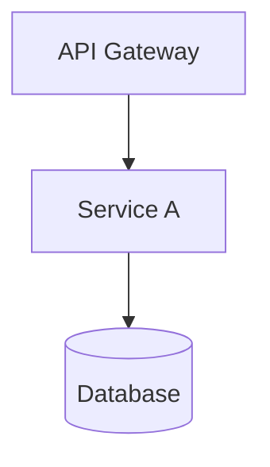
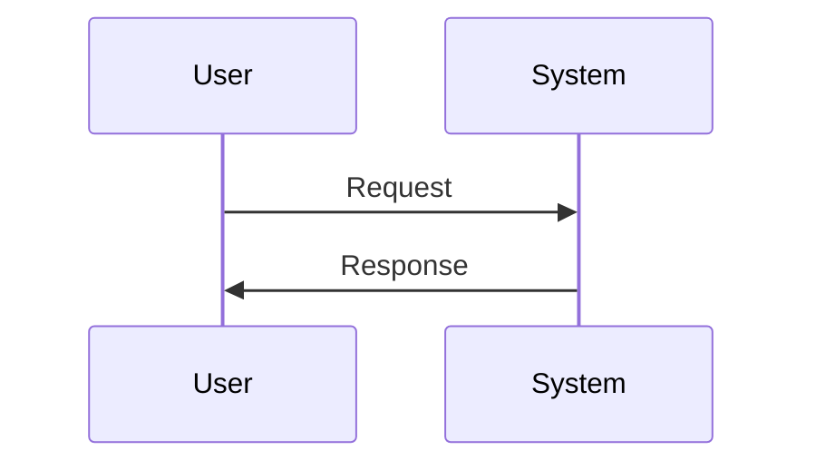
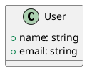

# ═════════════════════════════════════════════════════════════════════════════
# Skills for Presentation Content Generation
# ═════════════════════════════════════════════════════════════════════════════

> [🏠 Главная](../../../../../../README.md) → [🦞 OpenClaw](../../../../../../README.md) → [🎯 Workspace](../../../../README.md) → [📽️ Presentation](../README.md) → [🎨 Skills](#)

---

## Description

Навык для генерации контента презентаций: слайды, диаграммы, заметки спикера.

---

## 🎯 Capabilities

### 📝 Slide Generation

**Использование:**
```
👤 "Создай презентацию про архитектуру проекта"
👤 "Сделай слайд про масштабирование"
👤 "Добавь диаграмму данных"
```

**Действия:**
```bash
1. Анализирует тему презентации
2. Генерирует структуру (оглавление, слайды)
3. Создаёт markdown файлы для каждого слайда
4. Добавляет диаграммы (Mermaid, PlantUML)
5. Включает примеры кода с подсветкой
6 Добавляет speaker notes
```

**Пример:**
```markdown
# slides/01-architecture.md
# 🏗️ Architecture

## System Overview



## Key Components

- **API Gateway** — Entrypoint
- **Service A** — Core business logic
- **Database** — PostgreSQL cluster

Note:
Speaker notes:
Time: 2 minutes
Key points:
- Mention scalability
- Explain technology choices
```

---

### 🎨 Slide Design

**Использование:**
```
👤 "Оформи слайды в корпоративном стиле"
👤 "Примени тему dark mode"
👤 "Добавь логотип компании"
```

**Действия:**
```bash
1. Применяет цветовую схему
2. Настраивает шрифты
3. Добавляет логотипы
4. Применяет анимации
```

---

### 📊 Diagram Generation

**Mermaid Diagrams:**



**PlantUML (UML):**



---

### 🎤 Speaker Notes

**Генерация заметок:**
```
Slide: "Architecture Overview"

Notes:
- 🎯 Цель: Объяснить архитектуру
- ⏱️ Время: 3-5 минут
- 📚 Ключевые слова:
  • Масштабируемость
  • Отказоустойчивость
  • Безопасность
- 💬 Ключевые сообщения:
  • "Архитектура поддерживает 10k RPS"
  • "Failover за 30 секунд"
  • "Zero-downtime деплой"
```

---

## 📝 Presentation Workflow

```
┌─────────────────────────────────────────────────────┐
│ 1. Анализ темы презентации                        │
│    • Определить целевую аудиторию                 │
│    • Установить ключевые сообщения                │
│    • Определить глубину покрытия                  │
└─────────────────────────────────────────────────────┘
    ↓
┌─────────────────────────────────────────────────────┐
│ 2. Генерация структуры                            │
│    • Title slide                                  │
│    • Introduction                               │
│    • Main content slides                          │
│    • Demo/Examples                               │
│    • Conclusion                                 │
└─────────────────────────────────────────────────────┘
    ↓
┌─────────────────────────────────────────────────────┐
│ 3. Создание слайдов                                │
│    • Markdown формат                              │
│    • Code examples                               │
│    • Diagrams (Mermaid)                            │
│    • Images                                      │
└─────────────────────────────────────────────────────┘
    ↓
┌─────────────────────────────────────────────────────┐
│ 4. Добавление оформления                           │
│    • Custom theme                                  │
│    • Animations                                   │
│    • Transitions                                  │
│    • Logo, branding                              │
└─────────────────────────────────────────────────────┘
    ↓
┌─────────────────────────────────────────────────────┐
│ 5. Speaker notes                                   │
│    • Timing                                       │
│    • Key messages                                │
│    • Q&A preparation                             │
└─────────────────────────────────────────────────────┘
```

---

## 🔗 Integration with Tools

Использует инструменты:
- **write** — создание markdown файлов
- **read** — чтение существующего контента
- **bash** — сборка презентации

---

## 📝 Usage Examples

```
👤 "Создай техническую презентацию по microservices"

🤖 Presentation Skill (via Main → ContentGenerator → SlideDesigner):
    1. 📋 Analysing topic...
    2. 📝 Creating structure:
       - Introduction
       - What are Microservices?
       - Architecture Patterns
       - Communication (REST, gRPC, messaging)
       - Service Discovery
       - Deployment Strategies
    3. 🎨 Creating slides:
       - 01-introduction.md
       - 02-architecture.md
       - 03-patterns.md
       - 04-communication.md
       - 05-deployment.md
       - 06-best-practices.md
       - 07-summary.md
    4. 📊 Adding diagrams:
       - Architecture diagram (Mermaid)
       - Communication patterns
       - Deployment flow
    5. ✅ Presentation ready (7 slides)
```

---

## 🎨 Slide Templates

### Title Slide

```markdown
# 🎯 [Title]

## [Subtitle]

<div class="r-fit">
  
</div>

**Presenter Name**
• Role / Title
• @twitter_handle

<aside class="notes">
Speaker notes:
- Introduce yourself
- Mention experience
- Set expectations
</aside>
```

### Content Slide

```markdown
## [Title]

### Point 1
Description of point 1

<div class="fragment fade-in">
### Point 2
Description of point 2
</div>

<div class="fragment fade-up">
### Point 3
Description of point 3
</div>

---

## Code Slide

```markdown
## Example Implementation

```python
def process_data(data: List[Item]) -> Result:
    """Process data efficiently."""
    return [
        transform(item)
        for item in data
        if is_valid(item)
    ]
```

<aside class="notes">
Speaker notes:
- Explain algorithm
- Time complexity: O(n)
- Space complexity: O(n)
</aside>
```

---

## 🔗 Voice Commands

| Голосовая команда | Действие |
|-------------------|----------|
| "Создай презентацию..." | Генерация структуры |
| "Добавь слайд про..." | Создание слайда |
| "Добавь диаграмму..." | Генерация Mermaid |
| "Собери презентацию" | Сборка HTML |
| "Экспорт в PDF" | Экспорт |

---

## 📚 См. Также

- [🎨 Skills Index](../../../../../../workspace/SKILLS-INDEX.md)
- [📽️ Presentation README](../README.md)
- [🤖 Agents](../../../../../../workspace/AGENTS.md)

---

## 🔄 История Изменений

| Версия | Дата | Изменения |
|--------|------|-----------|
| 1.0.0 | 2025-11-05 | Первая версия skill |

---

> [🏠 Главная](../../../../../../README.md) → [🦞 OpenClaw](../../../../../../README.md) → [🎯 Workspace](../../../../README.md) → [📽️ Presentation](../README.md) → [🎨 Skills](#)
