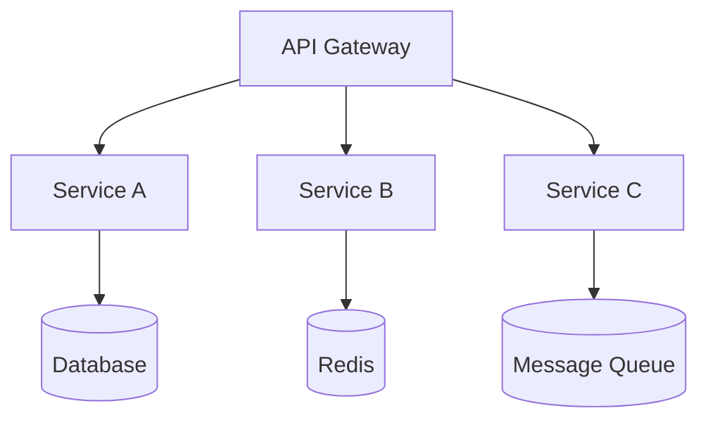

# ═════════════════════════════════════════════════════════════════════════════
# Presentation Example Slides
# ═════════════════════════════════════════════════════════════════════════════

<!-- ============================================================================ -->
# Slide 1: Introduction
<!-- ============================================================================ -->
slides/01-introduction.md
# 🎯 Project Overview

## What We'll Cover

<div class="fragment fade-in">
- 📊 Architecture
- 🔧 Best Practices
- 🎯 Real-world Examples
</div>

---

<!-- ============================================================================ -->
# Slide 2: Architecture
<!-- ============================================================================ -->
slides/02-architecture.md
# 🏗️ Architecture

## System Components



## Key Design Decisions

- **Microservices** for scalability
- **Event-driven** for loose coupling
- **CQRS** for read optimization

---

<!-- ============================================================================ -->
# Slide 3: Code Example
<!-- ============================================================================ -->
slides/03-demo.md
# 💻 Code Example

## FastAPI Endpoint

```python
from fastapi import FastAPI
from pydantic import BaseModel

app = FastAPI()

class User(BaseModel):
    email: str
    name: str

@app.post("/users")
async def create_user(user: User):
    """Create new user"""
    return {"id": "123", **user.model_dump()}
```

---

<!-- ============================================================================ -->
# Slide 4: Diagram with Notes
<!-- ============================================================================ -->
slides/04-conclusion.md
# 🎉 Summary

## Key Takeaways

<div class="fragment fade-up">
1. ✅ Simple architecture
2. ✅ Scalable design
3. ✅ Production ready
</div>

<aside class="notes">
Speaker notes:
- Remind about Q&A session
- Share contact info
- Thank the audience
</aside>

---

## Q&A

🙋 Questions?
